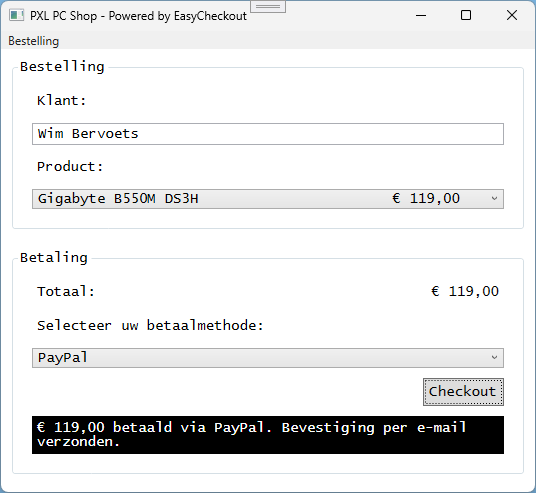
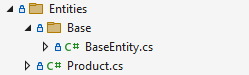
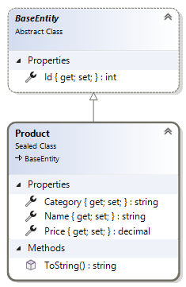
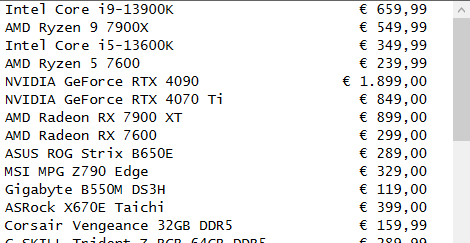
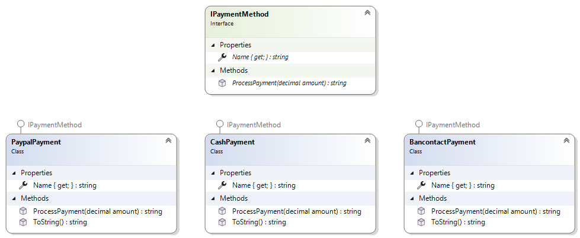
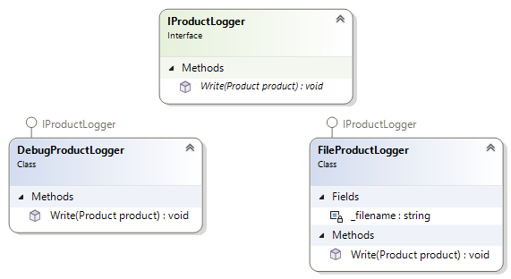

# Labo 8 - Interfaces

## Doel
In dit labo maken we een applicatie die zal worden gebruikt in door de PXL PC-shop.  Nadat de naam van de klant wordt ingegeven en het gewenste product wordt geselecteerd moet de gebruiker een betaalwijze selecteren. Afhankelijk van de gekozen waarde zal de gepaste procedure worden uitgevoerd wanneer er op de *Checkout* knop geklikt wordt.



## UI
Gebruik de volgende eigenschappen voor het MainWindow:
- Titel: PXL PC Shop - Powered by EasyCheckout
- Hoogte: 500
- Breedte: 550
- Lettertype: Lucida Console
- Lettergrootte: 14

**Gebruik de XAML-code helemaal onderaan als inhoud voor het MainWindow en voorzie de juiste event-procedures in het code-behind bestand.**

## Entities
- Maak een folder aan met de naam *Entities*
- Maak in de *Entities*-folder een subfolder met de naam *Base*
- Voeg een *BaseEntity* class toe aan de *Base*-folder
- Voeg een *Product* class toe aan de *Entities*-folder



- Implementeer beide classes zoals in onderstaande diagram wordt weergeven



- Zorg ervoor dat de *ToString()* functie de naam van het product teruggeeft aangevuld met spaties aan de rechterkant zodat de totale lengte 40 is. Plak daar de prijs aan vast voorafgegaan door spaties zodat de totale lengte 10 is, zorg ook dat de prijs als munteenheid getoond wordt.



## Interfaces
- Maak een folder aan met de naam *Interfaces*
- Maak in de *Interfaces*-folder 2 interfaces aan:
    ### IPaymentMethod
    - Voorzie een readonly property *Name*
    - Voorzie een string-functie *ProcessPayment* die een parameter met de naam *amount* heeft van het type *decimal*
    ### IProductLogger
    - Voorzie een void-methode *Write* die een parameter met de naam *product* heeft van het type *Product*

## Data
- Maak een folder aan met de naam *Data*
- Maak 2 classes aan in deze folder:
    - PaymentStore 
    - ProductStore

```csharp
internal class PaymentStore
{
    public IReadOnlyList<IPaymentMethod> GetAvailablePaymentMethods()
    {
        return new List<IPaymentMethod>
        {
            new BancontactPayment(),
            new CashPayment(),
            new PaypalPayment()
        };
    }
}
```

```csharp
internal class ProductStore
{
    public IReadOnlyList<Product> GetAllProducts()
    {
        return new List<Product>
        {
            new Product { Id = 1, Name = "Intel Core i9-13900K", Category = "CPU", Price = 659.99m },
            new Product { Id = 2, Name = "AMD Ryzen 9 7900X", Category = "CPU", Price = 549.99m },
            new Product { Id = 3, Name = "Intel Core i5-13600K", Category = "CPU", Price = 349.99m },
            new Product { Id = 4, Name = "AMD Ryzen 5 7600", Category = "CPU", Price = 239.99m },

            new Product { Id = 5, Name = "NVIDIA GeForce RTX 4090", Category = "GPU", Price = 1899.00m },
            new Product { Id = 6, Name = "NVIDIA GeForce RTX 4070 Ti", Category = "GPU", Price = 849.00m },
            new Product { Id = 7, Name = "AMD Radeon RX 7900 XT", Category = "GPU", Price = 899.00m },
            new Product { Id = 8, Name = "AMD Radeon RX 7600", Category = "GPU", Price = 299.00m },

            new Product { Id = 9, Name = "ASUS ROG Strix B650E", Category = "Moederbord", Price = 289.00m },
            new Product { Id = 10, Name = "MSI MPG Z790 Edge", Category = "Moederbord", Price = 329.00m },
            new Product { Id = 11, Name = "Gigabyte B550M DS3H", Category = "Moederbord", Price = 119.00m },
            new Product { Id = 12, Name = "ASRock X670E Taichi", Category = "Moederbord", Price = 399.00m },

            new Product { Id = 13, Name = "Corsair Vengeance 32GB DDR5", Category = "RAM", Price = 159.99m },
            new Product { Id = 14, Name = "G.SKILL Trident Z RGB 64GB DDR5", Category = "RAM", Price = 289.99m },
            new Product { Id = 15, Name = "Kingston Fury Beast 16GB DDR4", Category = "RAM", Price = 74.99m },
            new Product { Id = 16, Name = "Crucial Ballistix 32GB DDR4", Category = "RAM", Price = 124.99m },

            new Product { Id = 17, Name = "Samsung 990 Pro 1TB NVMe SSD", Category = "Opslag", Price = 179.99m },
            new Product { Id = 18, Name = "Crucial MX500 2TB SATA SSD", Category = "Opslag", Price = 129.99m },
            new Product { Id = 19, Name = "Seagate Barracuda 4TB HDD", Category = "Opslag", Price = 99.99m },
            new Product { Id = 20, Name = "Western Digital Black 2TB NVMe", Category = "Opslag", Price = 249.99m },

            new Product { Id = 21, Name = "NZXT H510 Behuizing", Category = "Behuizing", Price = 89.99m },
            new Product { Id = 22, Name = "Corsair 4000D Airflow", Category = "Behuizing", Price = 94.99m },
            new Product { Id = 23, Name = "Fractal Design Meshify C", Category = "Behuizing", Price = 109.99m },
            new Product { Id = 24, Name = "Cooler Master MasterBox NR600", Category = "Behuizing", Price = 74.99m },

            new Product { Id = 25, Name = "Noctua NH-D15 CPU Cooler", Category = "Koeling", Price = 94.99m },
            new Product { Id = 26, Name = "Corsair H150i Elite LCD", Category = "Koeling", Price = 229.99m },
            new Product { Id = 27, Name = "be quiet! Pure Rock 2", Category = "Koeling", Price = 39.99m },
            new Product { Id = 28, Name = "ARCTIC Liquid Freezer II 280", Category = "Koeling", Price = 109.99m },

            new Product { Id = 29, Name = "Corsair RM850x PSU", Category = "Voeding", Price = 139.99m },
            new Product { Id = 30, Name = "Seasonic Focus GX-750", Category = "Voeding", Price = 119.99m },
            new Product { Id = 31, Name = "Cooler Master MWE 650 Bronze", Category = "Voeding", Price = 69.99m },
            new Product { Id = 32, Name = "be quiet! Straight Power 11 1000W", Category = "Voeding", Price = 179.99m },

            new Product { Id = 33, Name = "ASUS ROG Zephyrus G14", Category = "Laptop", Price = 1899.00m },
            new Product { Id = 34, Name = "Dell XPS 15", Category = "Laptop", Price = 1699.00m },
            new Product { Id = 35, Name = "MSI GF63 Thin", Category = "Laptop", Price = 899.00m },
            new Product { Id = 36, Name = "Lenovo Legion 5", Category = "Laptop", Price = 1249.00m },

            new Product { Id = 37, Name = "Logitech MX Master 3", Category = "Randapparatuur", Price = 89.99m },
            new Product { Id = 38, Name = "SteelSeries Apex Pro TKL", Category = "Randapparatuur", Price = 199.99m },
            new Product { Id = 39, Name = "Corsair K70 RGB MK.2", Category = "Randapparatuur", Price = 139.99m },
            new Product { Id = 40, Name = "Razer DeathAdder V2", Category = "Randapparatuur", Price = 59.99m },

            new Product { Id = 41, Name = "LG UltraGear 27'' QHD 144Hz", Category = "Randapparatuur", Price = 379.00m },
            new Product { Id = 42, Name = "ASUS TUF Gaming VG27AQ", Category = "Randapparatuur", Price = 429.00m },
            new Product { Id = 43, Name = "Dell UltraSharp U2723QE", Category = "Randapparatuur", Price = 629.00m },
            new Product { Id = 44, Name = "BenQ EX3501R Ultrawide", Category = "Randapparatuur", Price = 749.00m },

            new Product { Id = 45, Name = "Elgato Stream Deck MK.2", Category = "Accessoires", Price = 159.99m },
            new Product { Id = 46, Name = "Xbox Wireless Controller", Category = "Accessoires", Price = 59.99m },
            new Product { Id = 47, Name = "USB-C Docking Station", Category = "Accessoires", Price = 89.99m },
            new Product { Id = 48, Name = "Samsung 32GB USB 3.1 Stick", Category = "Accessoires", Price = 14.99m },
            new Product { Id = 49, Name = "TP-Link AX3000 WiFi 6 Adapter", Category = "Accessoires", Price = 39.99m },
            new Product { Id = 50, Name = "ASUS External Blu-ray Drive", Category = "Accessoires", Price = 129.99m },
        };
    }
}
```

## Services
- Maak een folder aan met de naam *Services*
- Voorzie hierin 3 classes die de interface *IPaymentMethod* implementeren



> [!TIP]  
> Zorg dat elke class een unieke string retourneert via de *ProcessPayment*-functie. bv: 
> ```
>   public string ProcessPayment(decimal amount)
>   {
>       return $"{amount:c} contant betaald. Vergeet het wisselgeld niet!";
>   } 
> ```

## Logger
- Maak een folder aan met de naam *Logging*
- Voorzie hierin 2 classes die de interface *IProductLogger* implementeren


> [!TIP]
> Gebruik Debug.WriteLine() en File.AppendAllText() om de *Write*-methode te implementeren

## Vereisten
- Zorg tijdens het laden van het venster dat de comboboxen gevuld worden met data. Gebruik hiervoor de PaymentStore en de ProductStore
- Zorg dat de totaalprijs wordt weergegeven elke keer wanneer een product wordt geselecteerd
- De *checkout* kan enkel gebeuren wanneer een product EN betaalwijze geselecteerd is
- Afhankelijk van de gekozen betaalwijze wordt het resultaat van de *checkout* (ProcessPayment) in het TextBlock getoond
- Elke keer een product verkocht wordt (checkout) moet dit worden gelogd met een *ProductLogger*
- Via het menu kan een nieuwe bestelling aangemaakt worden waardoor alle editors terug hun initiële waarde krijgen

## MainWindow.xaml
```xml
<DockPanel>
    <Menu DockPanel.Dock="Top">
        <MenuItem Header="Bestelling">
            <MenuItem Header="Nieuw" Click="OnNewOrder_Clicked"/>
        </MenuItem>
    </Menu>    
    
    <StackPanel>
        <GroupBox Header="Bestelling" Margin="10" Padding="10">
            <StackPanel>
                <Label Content="Klant:" Margin="5"/>
                <TextBox x:Name="customerTextBox" Margin="5" Padding="3"/>
                <Label Content="Product:" Margin="5"/>
                <ComboBox x:Name="productsComboBox" Margin="5" SelectionChanged="OnProduct_SelectionChanged"/>
            </StackPanel>
        </GroupBox>
        <GroupBox Header="Betaling" Margin="10" Padding="10">
            <StackPanel>
                <Grid>
                    <Grid.ColumnDefinitions>
                        <ColumnDefinition/>
                        <ColumnDefinition Width="Auto"/>
                    </Grid.ColumnDefinitions>
                    <Label Content="Totaal: " Margin="5"/>
                    <Label Grid.Column="1" x:Name="amountLabel" Margin="5"/>
                </Grid>
                <Label Content="Selecteer uw betaalmethode:" Margin="5"/>
                <ComboBox Margin="5" x:Name="paymentMethodComboBox"/>
                <Button HorizontalAlignment="Right" Content="Checkout" Margin="5" Padding="6" Click="OnCheckout_Clicked"/>
                <TextBlock x:Name="paymentResultTextBlock" Margin="5" TextWrapping="Wrap" Background="Black" Foreground="White" Padding="5"/>
            </StackPanel>
        </GroupBox>
    </StackPanel>
</DockPanel>
```